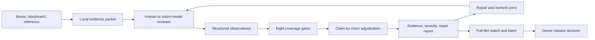

# OpenFilmQA

**Evidence-first quality review for AI-generated films.**

Make review findings traceable, separate false alarms from real faults, and keep
shot checks separate from the experience of watching a whole movie.

OpenFilmQA v0.1 prepares real review packets and runs eight quality gates on
structured observations supplied by a human or a vision-capable model. It is a
small working foundation from Bao Studio's Little Bao House production workflow.
It does **not** include a vision model or pretend that metadata can tell you a
movie is beautiful. No account, API key or paid model call is required.

## Try the real example

Requires Python 3.10 or later. The review engine uses the standard library only.

```sh
git clone https://github.com/BaoPham9x/OpenFilmQA.git
cd OpenFilmQA
python3 -m openfilmqa review examples/little-bao-house/before.json --out output/before
python3 -m openfilmqa review examples/little-bao-house/after.json --out output/after
```

The first command returns **1** because a confirmed wrong-room finding requires
revision. The second returns **2**, meaning that the corrected room matches the
specification, but the other visual checks and complete-film review are still
unreviewed. This is intentional: a corrected still cannot approve a movie.

[See the real before/after case study](examples/little-bao-house/README.md).

| Before | After |
|---|---|
|  |  |

## Prepare your own movie

Install FFmpeg/ffprobe separately for this command. They are not needed to run a
JSON review. Choose timestamps that cover actual story beats and shot joins.

```sh
python3 -m openfilmqa prepare my-film.mp4 --at 0.5,12,28.5 --out output/my-film \
  --reference approved-room.jpg --storyboard scene-board.jpg
```

This extracts real timestamped JPEG frames, probes streams, records the movie
and evidence SHA-256 hashes, and writes a model-neutral review brief. It does
not send your media anywhere, decode the entire movie, analyze its audio, or
call a model. The packet always starts **unreviewed**.

Watch and listen to the movie at normal speed using your own player. Give the
packet, scene specification and actual footage to your preferred reviewer.
Record observations in the format shown in `examples/little-bao-house/before.json`.
The `expected` and `observed` values can be strings, lists or JSON objects.
Missing categories, nulls, blank strings and empty containers remain unreviewed.
Use explicit observations such as `false` for no artifact or `{"count": 0}` for no props. Each evidence file must exist inside the
review input folder, with a timestamp and matching SHA-256.

## Eight review gates

| Gate | What the reviewer observes |
|---|---|
| `identity` | Character face, markings, proportions and identity |
| `wardrobe` | Clothing, apron, hat and accessories |
| `props` | Object presence, position and state across the action |
| `environment` | Room, table, windows, geography and lighting |
| `action` | Complete action, contact, eyeline and adjacent-shot phase |
| `scale` | Subject and object size against the approved scene |
| `artifacts` | Morphs, stray limbs, unnatural material and unintended frozen motion |
| `film_experience` | Full-film story, pacing, performance, picture and sound |

The first seven gates compare supplied observations with the approved shot
specification. They do not infer facts from pixels. A mismatch becomes a
**pending proposal**. An adjudicator marks it `confirmed` or `rejected`, with
reviewer name, reason, severity and repair recommendation. Rejected claims stay
in the report as an audit trail and do not count as real faults.

The eighth gate needs an explicit full-watch/full-listen reviewer attestation
for the same movie hash and verdicts on all five experience dimensions. It is
an attestation, not proof that OpenFilmQA itself watched the movie. Matching
stills, a numeric score, a sampled strip or successful FFmpeg output cannot
substitute for it. Creative, technical and release outcomes are separate.
Technical approval also needs a named, export-bound attestation that full decode
was checked and the export matches its delivery specification.

## Architecture



Python API:

```python
import json
from pathlib import Path
from openfilmqa import review

path = Path("examples/little-bao-house/before.json")
report = review(json.loads(path.read_text()), path.parent)
print(report["creative"], report["findings"])
```

CLI exit codes: **0** reviewed creative pass; **1** revision required; **2** review
incomplete; **3** malformed input/tool failure. A creative pass alone does not
approve technical delivery or publication. `report.json` and `report.md` expose
both confirmed/pending/rejected findings and every coverage gap.

## What we learned from production reviews

- Inspect actual media, not a reviewer's confident explanation.
- Reviewers can miss a changed room and invent a clothing or prop error.
- Keep exact final-cut timing; old shot lists can locate the wrong scene.
- A frame can establish room continuity, but cannot establish sound or a
  complete moving action. Inspect joins and the entire assembled film.
- Repair only the confirmed fault, then verify the repair did not add another.
- Do not enforce project-specific taste rules on every genre or call a style
  preference an objective defect. The director's intent and owner's eye matter.

These are workflow lessons, not a claim that a new prompt has learned a
filmmaker's taste or outperformed a baseline. The published example is a
historical repair, not a held-out model benchmark.

## Tests and roadmap

```sh
python3 -m unittest discover -s tests -v
```

v0.1: local packet extraction, evidence hashes, seven observation comparisons,
whole-film coverage gate, adjudication, readable reports and a real case study.

Next: a versioned JSON Schema, shot-join evidence strips, pluggable reviewer
adapters, export-spec checks, held-out calibration with false-positive/miss
rates, and motion/audio-aware review packets. Any future paid adapter must be
explicitly enabled by its user; this version has no network client.

## License and studio

Code and documentation: [MIT](LICENSE). Little Bao House artwork is excluded
and remains Bao Studio's IP; see the [example artwork notice](examples/little-bao-house/LICENSE.md).

Made by Bao Ngoc Pham at [Little Bao House / Bao Studio](https://rawdestiny.com/about/).
Contact: [help@rawdestiny.com](mailto:help@rawdestiny.com).
