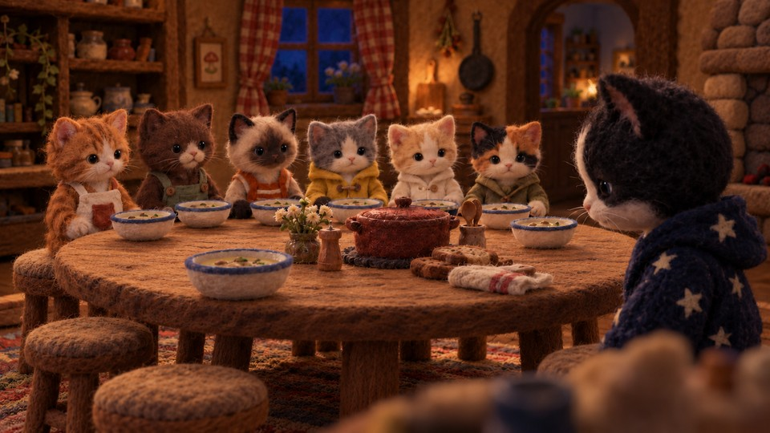
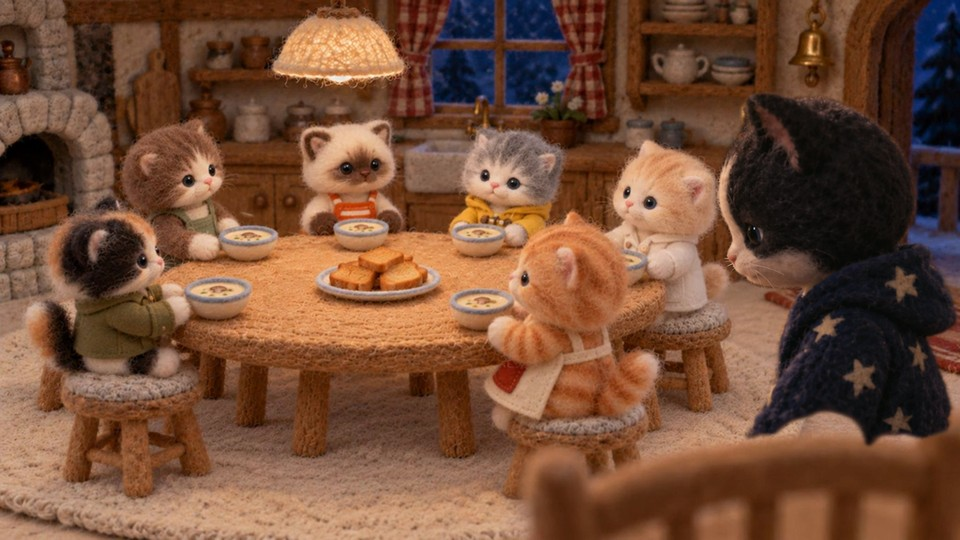
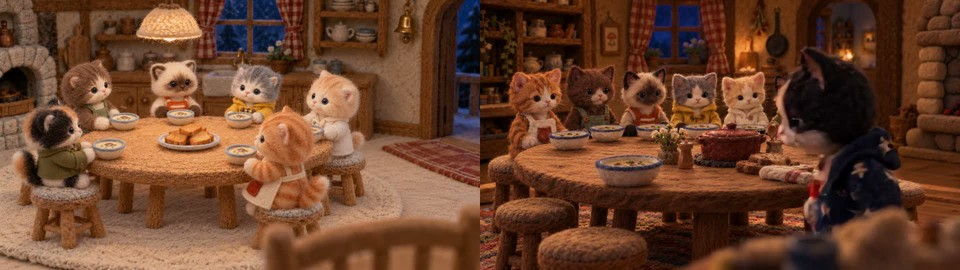

# A real room-continuity repair

In *Ginger and the Rainy Day Soup*, Oreo should join the same round family table
in the established kitchen. Shot s44 originally moved into a different dark room
with a red patterned pot and changed table props. Both automated reviewers missed
it. The production operator compared the real shots, confirmed the mismatch,
composited Oreo into the preceding room and generated a replacement take.

The scheduled interval in the corrected 125.14-second cut is **107.597 to 110.097 seconds**.
These are source stills used to produce the takes. Their timestamps identify the
shot's position in that cut; they are not falsely presented as extracted video frames.

| Before: different room | After: established kitchen |
|---|---|
|  |  |



Run from the repository root:

```sh
python3 -m openfilmqa review examples/little-bao-house/before.json --out output/before
# exit 1: a confirmed environment mismatch requires revision
python3 -m openfilmqa review examples/little-bao-house/after.json --out output/after
# exit 2: this environment mismatch is gone; full-film coverage is still incomplete
```

The observations in these JSON files were written after looking at the actual
images. The comparison engine checks them against the scene specification. It
has not independently recognized the room from the pixels.

Only room continuity is covered. The repaired still is not proof of good motion,
complete story action, sound, or a release-ready film. Those remain unreviewed.

## Provenance and lessons

Supplied by Bao Studio from its own production assets:
`stills/s44-v1-otherset.png`, `stills/s44.png`, and `qa/chk-light.jpg`.
Timing comes from `build/shots-actual.txt`; the older shot list was stale.
The original `qa/film-verdict.md` records the missed room fault and correction.
Images were resized for this public case study; originals remain unchanged.
No third-party reference-film images are distributed here.

The same production reports also record false alarms: a basket alleged to teleport
was actually held in Ginger's paw; a supposedly changed green apron was the same
white apron. Those findings were rejected after examining the real frames.
This is why proposals and confirmed defects are separate states in OpenFilmQA.
